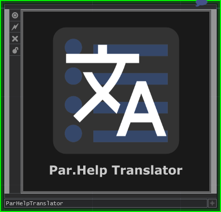
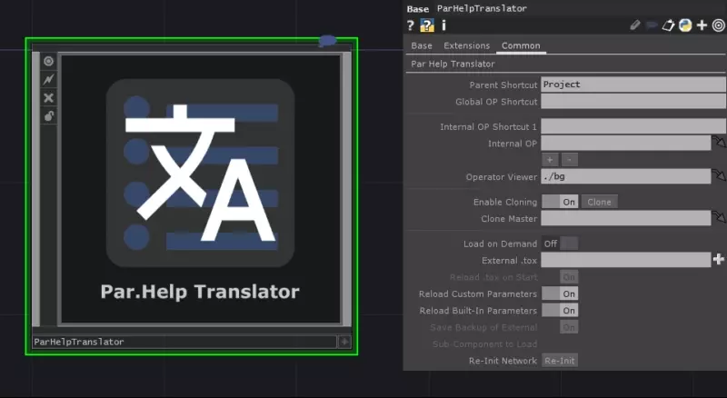
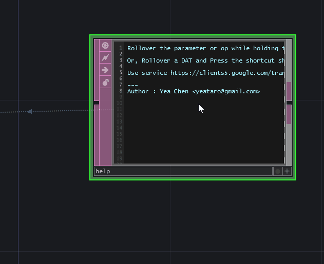
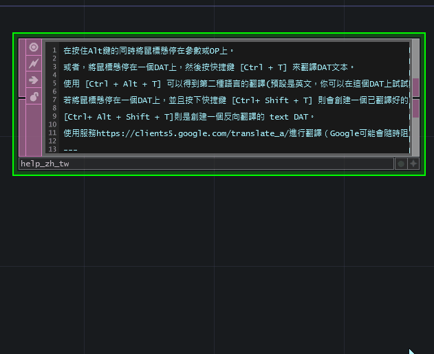
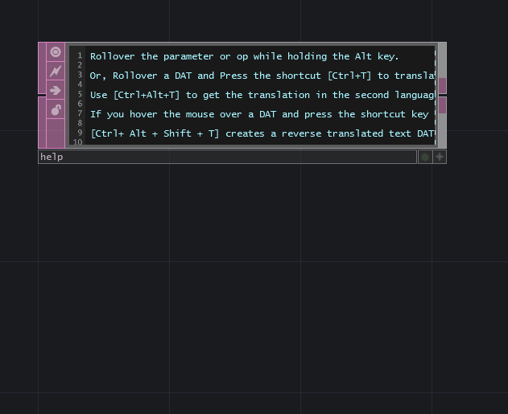
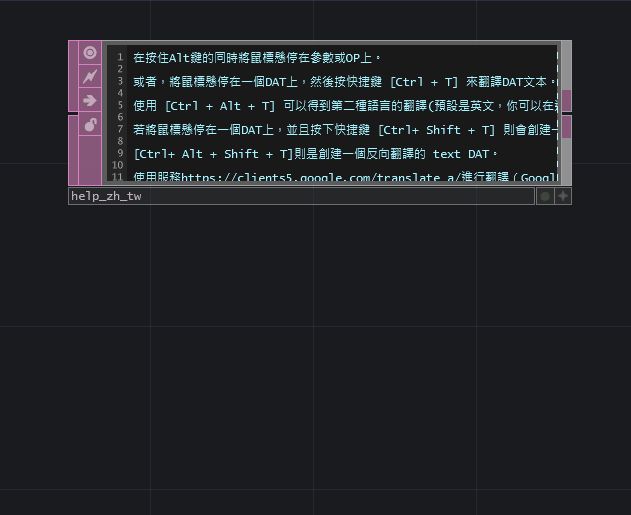
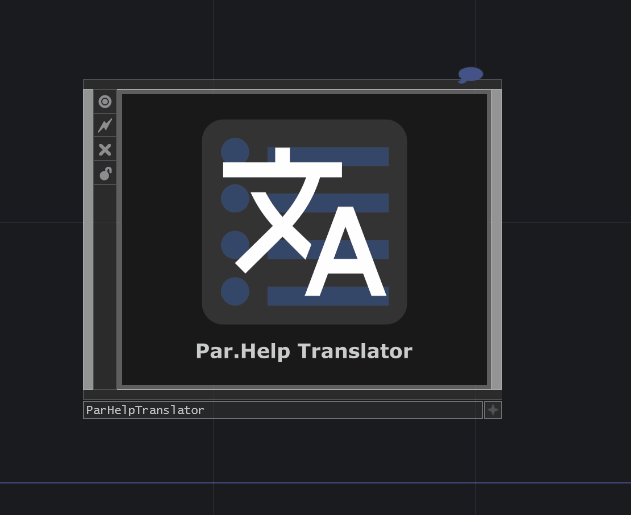
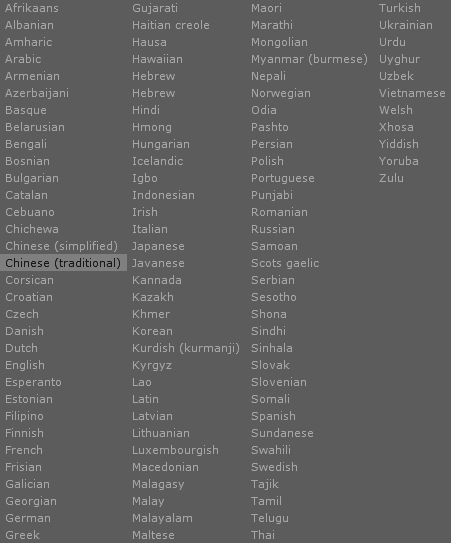

# TD-ParHelpTranslator

## Features

- Automatically translate the help text of parameters. Rollover the parameter while holding the `Alt` key.

- Optional function : OP's summaries can be translated. (Hold down the `Alt` key and rollover the OPs)

- Optional function 2 : Text of DAT can be translated. (Rollover a DAT and Press the `Ctrl+T`)

- Use `Ctrl+Alt+T` to get the translation in the second language (the default is English)

- If you hover the mouse over a DAT and press the shortcut key `Ctrl + Shift + T`, a translated text DAT will be created.

- `Ctrl + Alt + Shift + T` creates a reverse translated text DAT.

- You can do some operations on the floating window.

## Support language:

Use service `https://clients5.google.com/translate_a/` to translate, which is used in Google's Google Dictionary Chrome extension. (Google may block it at any time)

---
Author : Yea Chen <yeataro@gmail.com>

[TouchDesigner]: http://www.derivative.ca/
